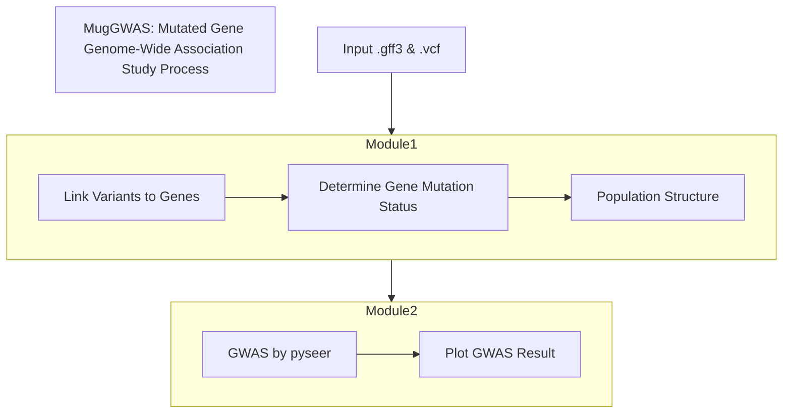

# Goals and Milestones
This package aims to infer gene-trait association by testing whether the mutation of a gene is associated with the trait. This will done by breaking the code into these modules:
|Modules|Rationale|Solution|
|:------|:--------|:-------|
|Compile a gene mutation table| A table that summarizes if a gene is mutated or not for each sample is more informative than the presence and absence of a gene.|Module 1|
|Run association test|Conduct GWAS using pyseer on the summary table|Module 2|
# Workflow
The workflow of this tool is shown [here](https://github.com/lyuchengmarvin/MugGWAS/blob/main/design_documents/MugGWAS.drawio.png).

# System Architecture

# Code modules
This tool uses these external tools–ANNOVAR (variant annotation) and pyseer (GWAS), which can be hard to install due to unbelievably demanding prerequisites. I will create a docker image to make the tool more accessible (2025.03.30).

**Module 1:** Make a mutation gene summary table.

  **Module 1.1:** Annotate variants and compile mutations.
  - Script:  `compile_variants_by_gene.py`.
  - Input:
    1.  `ref/`: A directory including a gene annotation file and a genome sequence file for the reference genome.
       - `ref.fna`: The sequence for the genome assembly. This should be in the fasta format.
       - `ref.gff3`: The gene annotation file for the reference genome. The chromosome name should match the VCF file. This can be acquired from genome annotation pipelines such as 'Bakta'.
    2. `snp.vcf.gz`: A VCF file resulted from variant calling. It should contain only single nucleotide variants. The chromosome name should match the gff3 file.
  - Output: A dictionary with samples and their mutation info. The mutation info will record the mutations for each gene, i.e. {'sample1': {gene1: (), gene2: (synonymous, nonsynonymous)}, 'sample2': {gene1: (synonymous, stopgain), gene2: (synonymous, synonymous)}}. 
  - Functionality: Annotate the variants for each sample to infer their mutations. Compile these mutations gene by gene.
  - Implementation log:
    2025.02.19 Implemented the read functions.
    2025.02.28 1. Thought about making this module object-oriented. 2. Doing a variant calling  on core genes might make it easier.
    2025.03.29 Make a object-oriented gene map to compile mutations. Integrate the external tool ANNOVAR to annotate the variants.
  
  **Module 1.2:** Determine mutation types and output summary table.
  - Script: `summarize_mutated_genes.py`
  - Input: Import the last module and make the dictionary.
  - Output: A summary table `gene_mutation_summary.txt` that looks like this:
    |Gene|Sample1|Sample2|Sample3|
    |:-:|:-:|:-:|:-:|
    |g1|m|w|w|m|
    |g2|m|m|m|w|
    |g3|w|w|w|m|
    |...|...|...|...|
  - Functionality: Determine the mutation types for each gene across all samples. Users can specify if they want to output 'binary genotypes', i.e. mutated or wildtype, or 'multiple genotypes', i.e. nonsense, nonstop, missense, silent, or wildtype.
  - Implementation log:
    2025.03.29 Finish the output function and acquire gene mutation summary table.
  
  **Module 1.3:** Prepare files that help account for the population structure effect.
  - Script: `make_pop_structure.py`
  - Input: There are two methods:
    1. Phylogeny-based: Output from IQ-tree `core_gene_tree.nwk`. A high-quality phylogeny based on single-copy core genes from a pangenome. 
    2. Kinship: A VCF file documenting variants on core genes `core_gene_snp.vcf.gz`.
  - Output: A `gen_dist.tsv` file that will correct for population structure.
  - Functionality: Prepare required files, including phenotype, genotype, and population structures.
    1. Phylogenetic-based: The script will infer population structure based on phylogenetic distances.
    2. Kinship: Variants on core gene sequences represent the result of vertical evolution. To make inferences for identical by descent, the script will calculate the kinship matrix from the genotype matrix of the presence and absence of variants.
  - implementation log:

**Module 2:** GWAS with `pyseer`. 
- Environment: `pyseer_env.yaml`
  **Module 2.1:** Run `pyseer` with fixed effect model and COG mode
  - Script: `run_pyseer_COG_pipeline.py`
  - Input:
    1. `phenotype.txt`
    2. `mutated_genes.txt`
    3. `gen_dist.tsv`
  - Output: A summary table `gwas_result.txt` that looks like this:
    |Gene|Pos|p-value|adj.p-value|-log(p)|Significance|
    |:---|:--|:------|:----------|:------|:-----------|
    |g1|contig1_300_1300|0.589|0.589|0.2298|No|
    |g2|contig1_1503_4534|0.00004|0.0324|1.489|No|
    |g3|contig3_57890_60378|0.00000000614|0.000045|4.346|Yes|
    |...|...|...|...|...|...|
  - Functionality: Run fixed effect model from `pyseer` to infer gene-trait association.
  - Implementation log:
    2025.02.28: The Bonferroni threshold depends on how many genes are tested.
    
  **Module 2.2:** Plot GWAS result.
  - Script: `plot_association_result.py`
  - Environment: `environment.yaml`
  - Input: `gwas_result.txt`
  - Output:
    1. Q-Q plot: `gwas_result.qq.png`
    2. manhattan plot: `gwas_result.man.png`
  - Functionality: Plot Q-Q plots and manhattan plots.
  - Implementation log:
