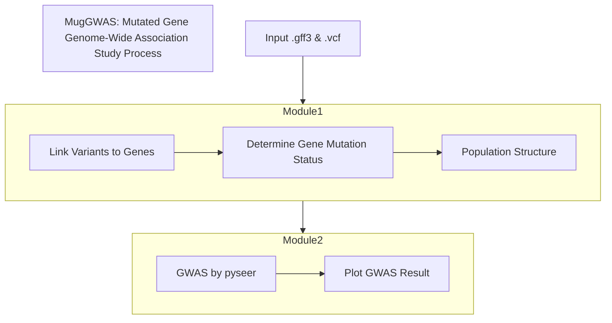

# Analysis scripts
This is a directory that stores scripts.

# System Architecture

# Code modules
I will make this a snakemake rule file when I learn how to do it (2025.02.28).
**Module 1:** Make a mutation gene summary table.
- Environment: `environment.yaml`

  **Module 1.1:** Read input and link variants to genes.
  - Script:  `compile_variants_by_gene.py`.
  - Input:
    1. `ref.gff3`: A gene annotation file for the reference genome. The chromosome name should match the VCF file.
    2. `snp.vcf.gz`: A VCF file resulted from variant calling. It should contain only single nucleotide variants. The chromosome name should match the gff3 file.
  - Output: A dictionary with genes and whatever variants on that gene for each sample, i.e. {gene_id:{sample:('site1:ref_allele:alt_allele', 'site2:ref_allele:alt_allele')}.
  - Functionality: Parse gff3 and VCF files to list the variants on each gene for each sample.
  - Implementation log:
    2025.02.19 Implemented the read functions.
    2025.02.28 1. Thought about making this module object-oriented. 2. Doing a variant calling  on core genes might make it easier.
  
  **Module 1.2:** Iteratively determine if a gene is mutated for each sample for each gene.
  - Script: `summarize_mutated_genes.py`
  - Input: Import the last module and make the dictionary.
  - Output: A summary table `mutated_genes.txt` that looks like this:
    |Gene|Sample1|Sample2|Sample3|
    |:-:|:-:|:-:|:-:|
    |g1|m|w|w|m|
    |g2|m|m|m|w|
    |g3|w|w|w|m|
    |...|...|...|...|
  - Functionality: Determine if deleterious or nonsynonymous mutants exist on each gene for each sample.
  - Implementation log:
  
  **Module 1.3:** Prepare files that help account for the population structure effect.
  - Script: `make_pop_structure.py`
  - Input: There are two methods:
    1. Phylogeny-based: Output from IQ-tree `core_gene_tree.nwk`. A high-quality phylogeny based on single-copy core genes from a pangenome. 
    2. Kinship: A VCF file documenting variants on core genes `core_gene_snp.vcf.gz`.
  - Output: A `gen_dist.tsv` file that will correct for population structure.
  - Functionality: Prepare required files, including phenotype, genotype, and population structures.
    1. Phylogenetic-based: The script will infer population structure based on phylogenetic distances.
    2. Kinship: Variants on core gene sequences represent the result of vertical evolution. To make inferences for identical by descent, the script will calculate the kinship matrix from the genotype matrix of the presence and absence of variants.
  - implementation log:

**Module 2:** GWAS with `pyseer`. 
- Environment: `pyseer_env.yaml`
  **Module 2.1:** Run `pyseer` with fixed effect model and COG mode
  - Script: `run_pyseer_COG_pipeline.py`
  - Input:
    1. `phenotype.txt`
    2. `mutated_genes.txt`
    3. `gen_dist.tsv`
  - Output: A summary table `gwas_result.txt` that looks like this:
    |Gene|Pos|p-value|adj.p-value|-log(p)|Significance|
    |:---|:--|:------|:----------|:------|:-----------|
    |g1|contig1_300_1300|0.589|0.589|0.2298|No|
    |g2|contig1_1503_4534|0.00004|0.0324|1.489|No|
    |g3|contig3_57890_60378|0.00000000614|0.000045|4.346|Yes|
    |...|...|...|...|...|...|
  - Functionality: Run fixed effect model from `pyseer` to infer gene-trait association.
  - Implementation log:
    2025.02.28: The Bonferroni threshold depends on how many genes are tested.
    
  **Module 2.2:** Plot GWAS result.
  - Script: `plot_association_result.py`
  - Environment: `environment.yaml`
  - Input: `gwas_result.txt`
  - Output:
    1. Q-Q plot: `gwas_result.qq.png`
    2. manhattan plot: `gwas_result.man.png`
  - Functionality: Plot Q-Q plots and manhattan plots.
  - Implementation log:
